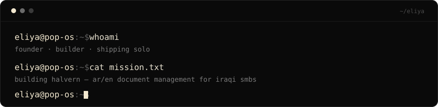

<div align="center">
  
</div>

<br/>

```bash
eliya@pop-os:~$ ls ./stack
nextjs   node   postgres   prisma   docker   github-actions   pop-os   aws

eliya@pop-os:~$ tail -f status.log
[building]  halvern — ar/en document management for iraqi smbs
[mode]      solo founder, funding it with a day job
[shipping]  anyway
```

<br/>

<div align="center">
  
</div>